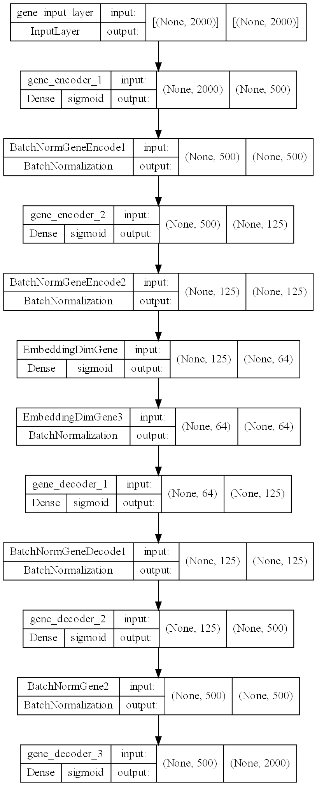
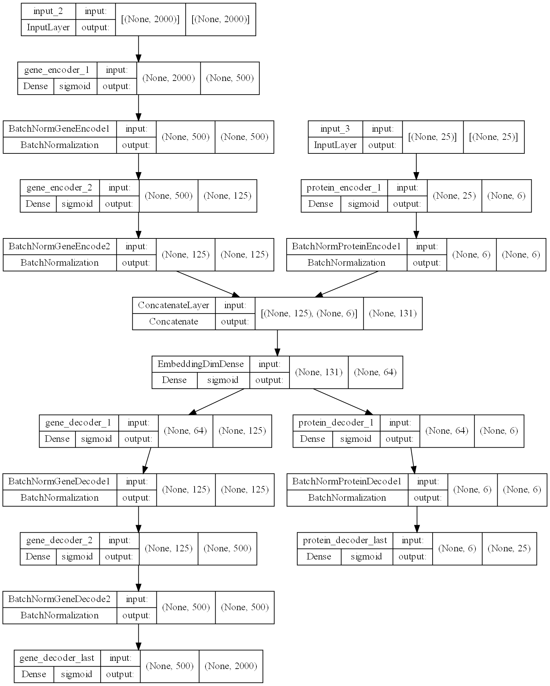
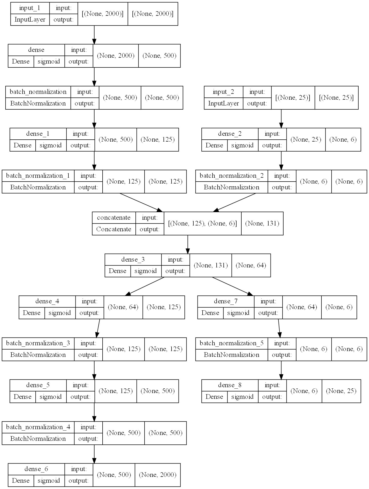

# scMultiomics_DeepLearning
## Integrative analysis using Autoencoders
The emergence of single-cell multimodal omics enabled multiple molecular programs to be simultaneously measured in individual cells at unprecedented resolution. However, analysis of sc-multimodal omics data is challenging due to lack of methods (?) that can accurately integrate across multiple data modalities. Here, we present Deep-N-omics, an approach for integrative analysis using Autoencoders. 


## Methods: Preprocessing
All data sourced from [GEO](https://www.ncbi.nlm.nih.gov/geo/) were processed in R v4.1.2 using `Seurat`. The count matrix of both RNA and ADT data (if any) were loaded in with their respective barcodes, either using `Seurat::Read10X` or `readr::read_csv`. A `SeuratObject` was created with the RNA-seq data and additional assays from ADT were loaded in using `CreateAssayObject(counts = ds.adt)`. The counts for both RNA-seq and ADT seq can now be normalized, and scaled using `ds %>% NormalizeData() %>% FindVariableFeatures() %>% ScaleData()`. RNA and ADT normalized & count data were saved and then processed in Python using our autoencoders.

**NOTE**: We recommend saving the RNA-seq Count data with the filename `rna_scaled.csv.gz` and `protein_scaled.csv.gz`. At the very least, the file name should contain `rna` and `protein`. The data should also be either one of the following formats when loaded in using Python's `pandas`:

**Un-transposed**
|   | **Unnamed: 0** | **Cell_Barcode 1** | **Cell_Barcode 2** | **...** |
|---|----------------|--------------------|--------------------|---------|
| 0 | CD11a          | 1                  | 1                  | 1       |
| 1 | CD11c          | 1                  | 1.5                | 1       |
| 2 | CD8a           | 1.5                | -1.2               | 1.5     |
| 3 | ...            | -1.2               | 1                  | -1.2    |

or


**Transposed**
|                    | 0     | 1     | 2    | 3    |
|--------------------|-------|-------|------|------|
| **Unnamed: 0**     | CD11a | CD11c | CD8a | ...  |
| **Cell_Barcode 1** | 1     | 1.5   | 1    | 1.5  |
| **Cell_Barcode 2** | 1.5   | -1.2  | 1.5  | -1.2 |
| **...**            | -1.2  | 1     | -1.2 | 1    |

### Generating Metadata
In the event that metadata aka cell identity of immune cells are not given, we highly recommend generating one using `Seurat` as per in this [vignette](https://satijalab.org/seurat/articles/multimodal_reference_mapping.html). However, it is fine if you choose not to use one.

1. Transform the `SeuratObject` created earlier with `SCTransform()`
2. `FindTransferAnchors` on this `SeuratObject` and the reference data `pbmc_multimodal.h5seurat` from `Seurat`
3. `MapQuery()` on the `SeuratObject`
4. Save the metadata using `SeuratObject@meta.data`

**NOTE**: It is imperative that the normalized and scaled data of RNA and ADT to have the words 'rna' and 'protein' be in the filename and no other files. Metadata should also be supplied containing cell identities for each barcode (file name containing 'meta').

## Methods: Getting data ready for deep learning using Deep-N-Omics 
Our python package offers both the Tensorflow and Pytorch implementation of autoencoders. In order to do integrative analysis of CITE-seq data (di-omics), the following can be done, for example GSE100866.

First set the data directory that containts, `rna_scaled.csv.gz`, `protein_scaled.csv.gz` and `meta_data.csv.gz` (optional).
```Python
data_directory = 'Sample Datasets/GSE100866'
```

Next, using the function `compile_data()` from our package, all the data would be loaded. In the event that the protein and rna files have mismatched barcodes, an error would be thrown.

If you choose to not use a metadata file or lack one, supplying `use_template_metadata = True` into `compile_data()` would allow the generation of a template metadata for visualization purposes. The metadata would only contain the barcodes of each cell as the index and a target of 'placeholder' for visualization only.

`compile_data()` would use our other function `read_data()` to read in the data. `compile_data()` would also utilize the meta_data in order to come up with non-wordy celltype identifiers before pushing to `sklearn.preprocessing.LabelEncoder()`. 

`compile_data()` would return the following in order:

1. `meta_data`: Contains the metadata file if one is supplied. Otherwise, a template metadata file which only contains cell barcodes would be returned.
2. `pro`: Contains the transposed protein data as seen in section "Preprocessing: Transposed" with cell barcodes as an index.
3. `rna`: Contains the transposed rna data as seen in section "Preprocessing: Transposed" with cell barcodes as an index.
4. `cite_seq_data`: Contains the concatenated rna and protein data with their respective cell types in integers as the last column.
5. `labels_encoders`: Encoder that encodes the cell types to integers. This is returned so that integers can be mapped back to strings.
6. `labels`: An array of the predicted celltype from metadata
7. `data_with_targets`: `cite_seq_data` except with an additional last column containing `labels`

```Python
meta_data, pro, rna, cite_seq_data, labels_encoder, labels, data_with_targets = compile_data(data_directory, cell_type_col)
```

Use `generate_training()` to generate training data. It uses `train_test_split()` from sklearn but with fancier slicing steps. `split_training_with_labels()` allows for the splitting of gene and protein data in training and test data.
```Python
train_data, test_data, train_labels, test_labels = generate_training(data_with_targets, pro, gene_only = False)
gene_train_data,pro_train_data,gene_test_data,pro_test_data = split_training_with_labels(train_data, test_data, pro)
```

## Methods: Deep Learning with Deep-N-Omics 
### Mono-omic data
If you only have or choose to use mono-omic data (such as RNA expression from scRNA-seq), you can use the function `gene_only_encoder()`. 'GSE100866' and 'gene_only' are supplied here to save the models in the directory 'saved_models/GSE100866/gene_only_NHL...' 

In this case, we are expecting to have 2 hidden layers (in `N_hidden`) before the bottleneck layer that contains 64 nodes. Each layer would have 4 (in `division_rate`) times less nodes than the previous nodes. 


`gene_only_encoder` returns the following in order:

1. `history`: If this is a newly trained model, you can check the validation loss and training loss of the model for each epoch by running `print(history.history['val_loss'])` or `print(history.history['loss'])`. If this model was loaded from a saved model, it returns `'-'`
2. `autoencoder`: This is the full autoencoder with the output layer having the same number of nodes as the input layer.
3. `encoder`: This is the same autoencoder as `autoencoder`, except the last layer of this model is the bottleneck layer.

**WARNING**: If a `ValueError` is raised stating `"Failed to convert a NumPy array to a Tensor (Unsupported object type float)"`, this means that somewhere in `data_with_targets`, there is a column that is a string. We recommend checking the variables returned from `compile_data` and set the index manually using `df.set_index('BARCODE_COLUMN',inplace = True)`

```Python
history, autoencoder, encoder = gene_only_encoder(train_data, test_data, 64, 'GSE100866', 'gene_only', N_hidden = 2, division_rate = 4, actvn = 'sigmoid', epochs = 15)
```

After training, `plot_model()` was called to give a visual representation of the architecture of this model as shown below:



### Di-omic Data
To build the autoencoder, just use `gene_protein_encoder()`. 'GSE100866' and 'gene_pro' are supplied here to save the models in the directory 'saved_models/GSE100866/gene_pro_NHG...' 

In this case, we are trying to build an autoencoder with 2 hidden gene layers, 1 hidden protein layer and each layer's nodes is smaller than the previous one by a factor of 4. The bottleneck layer would have 64 nodes, activation functions for all layers would be 'sigmoid' and the number of epochs for the model to train on would be 15.

`gene_protein_encoder` returns the following in order:

1. `history`: If this is a newly trained model, you can check the validation loss and training loss of the model for each epoch by running `print(history.history['val_loss'])` or `print(history.history['loss'])`. If this model was loaded from a saved model, it returns `'-'`
2. `autodecoder`: This is the full autoencoder with the output layer having the same number of nodes as the input layer.
3. `merged`: This is the same autoencoder as `autodecoder`, except the last layer of this model is the bottleneck layer.

**WARNING**: If a `ValueError` is raised stating `"Failed to convert a NumPy array to a Tensor (Unsupported object type float)"`, this means that somewhere in `data_with_targets`, there is a column that is a string. We recommend checking the variables returned from `compile_data` and set the index manually using `df.set_index('BARCODE_COLUMN',inplace = True)`
```Python
history, autodecoder, merged = gene_protein_encoder(pro_train_data,gene_train_data,pro_test_data, gene_test_data, 64, 'GSE100866', 'gene_pro', N_hidden_gene = 2, N_hidden_protein = 1, division_rate = 4, actvn = 'sigmoid', epochs = 15, override = False)
```
After training, `plot_model()` was called to give a visual representation of the architecture of this model as shown below:




In order to visualize the cluster, just use the `merged` model which is the encoder portion of the autoencoder to predict. We will use UMAP to visualize our clustering.
```Python
N_predict = 5000
# Make the encoder do its job. We can now store this as an output to a var
training_predicted = merged.predict([gene_test_data[:N_predict],pro_test_data[:N_predict]])
reducer = umap.UMAP()
train_encoded_gp_UMAP = reducer.fit_transform(training_predicted)
train_encoded_Control_UMAP = reducer.fit_transform(test_data[:N_predict])
```

`generate_color()` and `generate_colormap()` functions allows for the generation of a colormap for each distinct class in `labels` and is a dictionary so that colors can be seen in the graph.

`comparison_cluster()` is a function that fits a logistic regressor with the UMAP-ed data and returns the score of the cluster as a quantitative proxy for how well the clustering performs.

`vis_data2d()` will plot the points given by the dimensionality reduction method (in this case UMAP), given the respective labels, labels_encoder, colormap, number of predictons and the data from `comparison_cluster()`

**WARNING**: If you are used `use_template_metadata = True` previously, please do not run `comparison_cluster()` as it expects at least 2 classes or 2 distinct cell types.
```Python
color = generate_color(labels_encoder, labels)
color_map = generate_colormap(color, labels_encoder, labels)
left, right = comparison_cluster(train_encoded_gp_UMAP, train_encoded_Control_UMAP,test_labels, N_predict = N_predict)
vis_data2d(train_encoded_gp_UMAP, train_encoded_Control_UMAP, test_labels, labels_encoder, color_map, N_predict, 
           left_label=f'Gene Protein UMAP-Score: {left}', right_label=f'Control UMAP-Score: {right}', spacer = 'GSE100866/gene_pro_Control_UMAP')
```


Other methods such as tSNE and `PyMDE` (Minimum-Distortion Embedding) also works as shown in our notebook.


### N-omic Data
If you are interested in performing more than di-omic integrative analysis, we provide an implementation for this.

The function for this would be `build_custom_autoencoders()`. Implementation of this might be a little tricky, but in this example, we show that we can implement a di-omic integrative analysis using this method.

`build_custom_autoencoders()` takes in a few arguments:


1. `concatenated_shapes` argument takes in a list of shapes. For our example, it is a list of shapes of `gene_train_data` and `pro_train_data`.
2. `saved_model_dir_name` which is the folder in which the model will be saved, it is identical to the mono-omic and di-omic implementation. 
3. `train_data_lst` argument takes in a list of training data. For our example, it is `gene_train_data` and `pro_train_data`. They need to be in the same order as in `concatenated_shapes`.
4.`n_hidden_layers` argument takes in a list or a tuple of hidden layers to use for each omic data. In our example, `(2,1)` means 2 hidden layers for the gene data and 1 hidden layer for the protein data.

```Python
_, __, merged_m = build_custom_autoencoders([gene_train_data.shape,pro_train_data.shape], 'GSE100866', '', [gene_train_data,pro_train_data],epochs = 15, override=  True,
                          n_hidden_layers = (2,1), division_rate = 4, actvn = 'sigmoid', embedding_dim = 64)
```

After training, `plot_model()` was called to give a visual representation of the architecture of this model as shown below: Note that it is similar, if not identical to the model plot as di-omic.



## Sample Datasets
### Datasets used to validate clustering ability of our autoencoder.
#### GSE128639 
Human bone marrow mononuclear cells - CITE-seq (Stuart et al., 2019). 25 antibodies described in ADT.
- [GE Link](https://www.ncbi.nlm.nih.gov/geo/query/acc.cgi?acc=GSE128639)
- [Article](https://doi.org/10.1016/j.cell.2019.05.031)
- Processed Data is also available through [SeuratData](https://github.com/satijalab/seurat-data). Can be accessed with a single command: `InstallData(ds = 'bmcite')`
#### GSE100866
CBMC (cord blood mononuclear cells) CITE-seq (Stoeckius et al., 2017). 13 antibodies described in ADT.
- [GE Link](https://www.ncbi.nlm.nih.gov/geo/query/acc.cgi?acc=GSE100866)
- [Article](https://www.nature.com/articles/nmeth.4380)
- Processed Data is also available through [SeuratData](https://github.com/satijalab/seurat-data). Can be accessed with a single command: `InstallData(ds = 'cbmc')`
#### GSE153056
Human ECCITE-seq (Papalexi et al., 2021). 
- [GE Link](https://www.ncbi.nlm.nih.gov/geo/query/acc.cgi?acc=GSE153056)
- [Article](https://www.nature.com/articles/s41588-021-00778-2)
- Processed data is also available through [SeuratData](https://github.com/satijalab/seurat-data). Can be accessed with single command: `InstallData(ds = “thp1.eccite”)`
#### GSE164378
Human PBMC - CITE-seq, ECITE-seq (Hao et al., 2021)
Dataset contains two batches and cells in both batches were annotated to 31 cell types. Batch 1 contains 67k cells (11k RNA, 228 ADT) and batch 2 contains 94k cells (12k RNA, 228 ADT). Celltype identification is given in GEO. Due to the large dataset, ~80,000 cells were randomly selected and processed for our project.
- [GE Link](https://www.ncbi.nlm.nih.gov/geo/query/acc.cgi?acc=GSE164378)
- [Article](https://www.ncbi.nlm.nih.gov/pmc/articles/pmid/34062119/)
### Datasets used to attempt to gain additional biological insights using our autoencoder.
#### GSE166489
PBMC CITE-seq (Ramaswamy et al.,2021) with 189 surface antibody phenotypes. Of the 38 samples under GSE166489, 5 included CITE-seq data (2 MIC-C patients and 3 healthy donors). The MIC-C patients and Healthy Donors' cell metadata was processed separately in Seurat as per in this [vignette](https://satijalab.org/seurat/articles/multimodal_reference_mapping.html)
- [GE Link](https://www.ncbi.nlm.nih.gov/geo/query/acc.cgi?acc=GSE166489)
- [Article](https://www.ncbi.nlm.nih.gov/pmc/articles/PMC8043654/)
#### E-MTAB-10026 
PBMC CITE-seq dataset (Stephenson et al., 2021 ) from healthy individuals and COVID-19 patients. 
#### Human PBMC-CITE-seq (Kotliarov et., 2020) 
CITE-seq profiling of 82 surface proteins and transcriptomes of 53,201 single cells from healthy high and low influenza-vaccination responders. Dataset can be downloaded from [here](https://nih.figshare.com/collections/Data_and_software_code_repository_for_Broad_immune_activation_underlies_shared_set_point_signatures_for_vaccine_responsiveness_in_healthy_individuals_and_disease_activity_in_patients_with_lupus_Kotliarov_Y_Sparks_R_et_al_Nat_Med_DOI_https_d/4753772)
