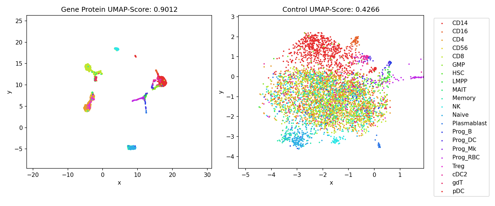

# scMultiomics_DeepLearning
## Integrative analysis using Autoencoders
The emergence of single-cell multimodal omics enabled multiple molecular programs to be simultaneously measured in individual cells at unprecedented resolution. However, analysis of sc-multimodal omics data is challenging due to lack of methods (?) that can accurately integrate across multiple data modalities. Here, we present Deep-N-omics, an approach for integrative analysis using Autoencoders. 


## Methods
### Preprocessing
All data sourced from [GEO](https://www.ncbi.nlm.nih.gov/geo/) were processed in R v4.1.2 using `Seurat`. The count matrix of both RNA and ADT data (if any) were loaded in with their respective barcodes, either using `Seurat::Read10X` or `readr::read_csv`. A `SeuratObject` was created with the RNA-seq data and additional assays from ADT were loaded in using `CreateAssayObject(counts = ds.adt)`. The counts for both RNA-seq and ADT seq can now be normalized, and scaled using `ds %>% NormalizeData() %>% FindVariableFeatures() %>% ScaleData()`. RNA and ADT normalized & count data were saved and then processed in Python using our autoencoders.


#### Generating Metadata
In the event that metadata aka cell identity of immune cells are not given, we highly recommend generating one using `Seurat` as per in this [vignette](https://satijalab.org/seurat/articles/multimodal_reference_mapping.html).

1. Transform the `SeuratObject` created earlier with `SCTransform()`
2. `FindTransferAnchors` on this `SeuratObject` and the reference data `pbmc_multimodal.h5seurat` from `Seurat`
3. `MapQuery()` on the `SeuratObject`
4. Save the metadata using `SeuratObject@meta.data`

**NOTE**: It is imperative that the normalized and scaled data of RNA and ADT to have the words 'rna' and 'protein' be in the filename and no other files. Metadata should also be supplied containing cell identities for each barcode (file name containing `meta`). 

### Using Tensorflow version of Deep-N-Omics
Our python package offers both the Tensorflow and Pytorch implementation of autoencoders. In order to do integrative analysis of CITE-seq data (di-omics), the following can be done, for example for GSE100866.

First set the data directory that containts, `rna_scaled.csv.gz`, `protein_scaled.csv.gz` and `meta_data.csv.gz`.
```Python
data_directory = 'Sample Datasets/GSE100866'
```

Next, using the function `compile_data()` from our package, all the data would be loaded. In the event that the protein and rna files have mismatched barcodes, an error would be thrown.

`compile_data()` would use our other function `read_data()` to read in the data. `compile_data()` would also utilize the meta_data in order to come up with non-wordy celltype identifiers before pushing to `sklearn.preprocessing.LabelEncoder()`. 

It would return `data_with_targets` which contain the concatenated rna and protein data with their respective cell types in integers.

`labels_encoder` would also be returned so that you can convert the integers back to string for cell type for later. `labels` are also returned to give an array of the predicted cell type from the metadata.
```Python
meta_data, pro, rna, cite_seq_data, labels_encoder, labels, data_with_targets = compile_data(data_directory, cell_type_col)
```

Use `generate_training()` to generate training data. It uses `train_test_split()` from sklearn but with fancier slicing steps. `split_training_with_labels()` allows for the splitting of gene and protein data in training and test data.
```Python
train_data, test_data, train_labels, test_labels = generate_training(data_with_targets, pro, gene_only = False)
gene_train_data,pro_train_data,gene_test_data,pro_test_data = split_training_with_labels(train_data, test_data, pro)
```

To build the autoencoder, just use `gene_protein_encoder()`. 'GSE100866' and 'gene_pro' are supplied here to save the models in the directory 'saved_models/GSE100866/gene_pro_NHG...' 
```Python
history, autodecoder, merged = gene_protein_encoder(pro_train_data,gene_train_data,pro_test_data, gene_test_data, 64, 'GSE100866', 'gene_pro', N_hidden_gene = 2, N_hidden_protein = 1, division_rate = 4, actvn = 'sigmoid', epochs = 15, override = False)
```

In order to visualize the cluster, just use the `merged` model which is the encoder portion of the autoencoder to predict. We will use UMAP to visualize our clustering.
```Python
# Perform the TSNE on the bottleneck layer of the encoded data and the non encoded data
N_predict = 5000
# Make the encoder do its job. We can now store this as an output to a var
training_predicted = merged.predict([gene_test_data[:N_predict],pro_test_data[:N_predict]])
reducer = umap.UMAP()
train_encoded_gp_UMAP = reducer.fit_transform(training_predicted)
train_encoded_Control_UMAP = reducer.fit_transform(test_data[:N_predict])
```

`generate_color()` and `generate_colormap()` functions allows for the generation of a colormap for each distinct class in `labels` and is a dictionary so that colors can be seen in the graph.

`comparison_cluster()` is a function that fits a logistic regressor with the UMAP-ed data and returns the score of the cluster as a quantitative proxy for how well the clustering performs.

`vis_data2d()` will plot the points given by the dimensionality reduction method (in this case UMAP), given the respective labels, labels_encoder, colormap, number of predictons and the data from `comparison_cluster()`
```Python
color = generate_color(labels_encoder, labels)
color_map = generate_colormap(color, labels_encoder, labels)
left, right = comparison_cluster(train_encoded_gp_UMAP, train_encoded_Control_UMAP,test_labels, N_predict = N_predict)
vis_data2d(train_encoded_gp_UMAP, train_encoded_Control_UMAP, test_labels, labels_encoder, color_map, N_predict, 
           left_label=f'Gene Protein UMAP-Score: {left}', right_label=f'Control UMAP-Score: {right}', spacer = 'GSE100866/gene_pro_Control_UMAP')
```



Other methods such as tSNE and `PyMDE` (Minimum-Distortion Embedding) also works as shown in our notebook.


## Sample Datasets
### GSE128639 
Human bone marrow mononuclear cells - CITE-seq (Stuart et al., 2019). 25 antibodies described in ADT.
- [GE Link](https://www.ncbi.nlm.nih.gov/geo/query/acc.cgi?acc=GSE128639)
- [Article](https://doi.org/10.1016/j.cell.2019.05.031)
- Processed Data is also available through [SeuratData](https://github.com/satijalab/seurat-data). Can be accessed with a single command: `InstallData(ds = 'bmcite')`
### GSE100866
CBMC (cord blood mononuclear cells) CITE-seq (Stoeckius et al., 2017). 13 antibodies described in ADT.
- [GE Link](https://www.ncbi.nlm.nih.gov/geo/query/acc.cgi?acc=GSE100866)
- [Article](https://www.nature.com/articles/nmeth.4380)
- Processed Data is also available through [SeuratData](https://github.com/satijalab/seurat-data). Can be accessed with a single command: `InstallData(ds = 'cbmc')`
### GSE153056
Human ECCITE-seq (Papalexi et al., 2021) Raw and processed sequencing data is available through the Gene Expression Omnibus (GEO accession number: GSE153056). 
- [GE Link](https://www.ncbi.nlm.nih.gov/geo/query/acc.cgi?acc=GSE153056)
- [Article](https://www.nature.com/articles/s41588-021-00778-2)
- Processed data is also available through [SeuratData](https://github.com/satijalab/seurat-data). Can be accessed with single command: `InstallData(ds = “thp1.eccite”)`
### GSE164378
Human PBMC - CITE-seq, ECITE-seq (Hao et al., 2021)
Dataset contains two batches and cells in both batches were annotated to 31 cell types. Batch 1 contains 67k cells (11k RNA, 228 ADT) and batch 2 contains 94k cells (12k RNA, 228 ADT). Celltype identification is given in GEO. Due to the large dataset, ~80,000 cells were randomly selected and processed for our project.
- [GE Link](https://www.ncbi.nlm.nih.gov/geo/query/acc.cgi?acc=GSE164378)
- [Article](https://www.ncbi.nlm.nih.gov/pmc/articles/pmid/34062119/)
### GSE166489
PBMC CITE-seq (Ramaswamy et al.,2021) with 189 surface antibody phenotypes. Of the 38 samples under GSE166489, 5 included CITE-seq data (2 MIC-C patients and 3 healthy donors). The MIC-C patients and Healthy Donors' cell metadata was processed separately in Seurat as per in this [vignette](https://satijalab.org/seurat/articles/multimodal_reference_mapping.html)
- [GE Link](https://www.ncbi.nlm.nih.gov/geo/query/acc.cgi?acc=GSE166489)
- [Article](https://www.ncbi.nlm.nih.gov/pmc/articles/PMC8043654/)
### E-MTAB-10026 
PBMC CITE-seq dataset (Stephenson et al., 2021 ) from healthy individuals and COVID-19 patients. 
### Human PBMC-CITE-seq (Kotliarov et., 2020) 
CITE-seq profiling of 82 surface proteins and transcriptomes of 53,201 single cells from healthy high and low influenza-vaccination responders. Dataset can be downloaded from [here](https://nih.figshare.com/collections/Data_and_software_code_repository_for_Broad_immune_activation_underlies_shared_set_point_signatures_for_vaccine_responsiveness_in_healthy_individuals_and_disease_activity_in_patients_with_lupus_Kotliarov_Y_Sparks_R_et_al_Nat_Med_DOI_https_d/4753772)
