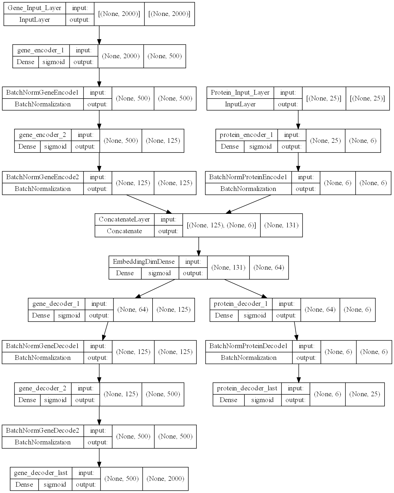

# scMultiomics_DeepLearning
## Integrative analysis using Autoencoders
The emergence of single-cell multimodal omics enabled multiple molecular programs to be simultaneously measured in individual cells at unprecedented resolution. However, analysis of sc-multimodal omics data is challenging due to lack of methods (?) that can accurately integrate across multiple data modalities. Here, we present Deep-N-omics, an approach for integrative analysis using Autoencoders. 


## Methods: Preprocessing
All data sourced from [GEO](https://www.ncbi.nlm.nih.gov/geo/) were processed in R v4.1.2 using `Seurat`. The count matrix of both RNA and ADT data (if any) were loaded in with their respective barcodes, either using `Seurat::Read10X` or `readr::read_csv`. A `SeuratObject` was created with the RNA-seq data and additional assays from ADT were loaded in using `CreateAssayObject(counts = ds.adt)`. The counts for both RNA-seq and ADT seq can now be normalized, and scaled using `ds %>% NormalizeData() %>% FindVariableFeatures() %>% ScaleData()`. RNA and ADT normalized & count data were saved and then processed in Python using our autoencoders.

**NOTE**: We recommend saving the RNA-seq Count data with the filename `rna_scaled.csv.gz` and `protein_scaled.csv.gz`. At the very least, the file name should contain `rna` and `protein`. The data should also be either one of the following formats when loaded in using Python's `pandas`:

**Un-transposed**
|   | **Unnamed: 0** | **Cell_Barcode 1** | **Cell_Barcode 2** | **...** |
|---|----------------|--------------------|--------------------|---------|
| 0 | CD11a          | 1                  | 1                  | 1       |
| 1 | CD11c          | 1                  | 1.5                | 1       |
| 2 | CD8a           | 1.5                | -1.2               | 1.5     |
| 3 | ...            | -1.2               | 1                  | -1.2    |

or


**Transposed**
|                    | 0     | 1     | 2    | 3    |
|--------------------|-------|-------|------|------|
| **Unnamed: 0**     | CD11a | CD11c | CD8a | ...  |
| **Cell_Barcode 1** | 1     | 1.5   | 1    | 1.5  |
| **Cell_Barcode 2** | 1.5   | -1.2  | 1.5  | -1.2 |
| **...**            | -1.2  | 1     | -1.2 | 1    |

### Generating Metadata
In the event that metadata aka cell identity of immune cells are not given, we highly recommend generating one using `Seurat` as per in this [vignette](https://satijalab.org/seurat/articles/multimodal_reference_mapping.html). However, it is fine if you choose not to use one, we would show an implementation on this case separately.

1. Transform the `SeuratObject` created earlier with `SCTransform()`
2. `FindTransferAnchors` on this `SeuratObject` and the reference data `pbmc_multimodal.h5seurat` from `Seurat`
3. `MapQuery()` on the `SeuratObject`
4. Save the metadata using `SeuratObject@meta.data`

**NOTE**: It is imperative that the normalized and scaled data of RNA and ADT to have the words 'rna' and 'protein' be in the filename and no other files. Metadata should also be supplied containing cell identities for each barcode (file name containing 'meta').

## Installing required dependencies
To fully utilize our package, it is recommended you install the required dependencies found in our `requirements.txt` by either installing them through `pip` or `conda`.

```bash
python -m pip install -r requirements.txt
```
or 
```bash
conda install --file requirements.txt
```
## Methods: Getting data ready for deep learning using Deep-N-Omics 
Our python package offers both the Tensorflow and Pytorch implementation of autoencoders. In order to do integrative analysis of CITE-seq data (di-omics), the following can be done, for example GSE128639.

First set the data directory that containts, `rna_scaled.csv.gz`, `protein_scaled.csv.gz` and `meta_data.csv.gz` (optional).
```Python
data_directory = 'Sample Datasets/GSE128639'
```

Next, using the function `load_data()` from our package, all the data would be loaded. In the event that the protein and rna files have mismatched barcodes, an error would be thrown.

`load_data()` would use our other function `get_path()` to read in the data. Do note that the structure of the dataframe for both `rna_scaled.csv.gz` and `protein_scaled.csv.gz` is assumed to have the cell barcodes to be as column names and the gene / protein features to be row names. If this is flipped, the argument `transpose = False` should be used instead.

`load_data()` would return the following in order:

1. `meta_data`: Contains the metadata file if one is supplied. Otherwise, a template metadata file which only contains cell barcodes would be returned.
2. `pro`: Contains the transposed protein data as seen in section "Preprocessing: Transposed" with cell barcodes as an index.
3. `rna`: Contains the transposed rna data as seen in section "Preprocessing: Transposed" with cell barcodes as an index.
4. `cite_data`: Contains the concatenated rna and protein data with their respective cell types in integers as the last column.

```Python
meta_data, pro, rna, cite_data = load_data(data_directory)
```

## Methods: Deep Learning with Deep-N-Omics 
### Mono-omic data
If you only have or choose to use mono-omic data (such as RNA expression from scRNA-seq), you can use the function `gene_only_encoder()`. 'GSE128639' and 'gene_only' are supplied here to save the models in the directory 'saved_models/GSE128639/gene_only_NHL...' 

In this case, we are expecting to have 2 hidden layers (in `N_hidden`) before the bottleneck layer that contains 64 nodes. Each layer would have 4 (in `division_rate`) times less nodes than the previous nodes. 


`gene_only_encoder` returns the following in order:

1. `history`: If this is a newly trained model, you can check the validation loss and training loss of the model for each epoch by running `print(history.history['val_loss'])` or `print(history.history['loss'])`. If this model was loaded from a saved model, it returns `'-'`
2. `autoencoder`: This is the full autoencoder with the output layer having the same number of nodes as the input layer.
3. `encoder`: This is the same autoencoder as `autoencoder`, except the last layer of this model is the bottleneck layer.

**WARNING**: If a `ValueError` is raised stating `"Failed to convert a NumPy array to a Tensor (Unsupported object type float)"`, this means that somewhere in `data_with_targets`, there is a column that is a string. We recommend checking the variables returned from `compile_data` and set the index manually using `df.set_index('BARCODE_COLUMN',inplace = True)`

```Python
GOhistory, GOautoencoder, GObottleneck = gene_only_encoder(rna, rna, 64, 'GSE128639', 'gene_only', N_hidden = 2, division_rate = 4, actvn = 'sigmoid',epochs=20)
```

After training, `plot_model()` was called to give a visual representation of the architecture of this model as shown below:


### Di-omic Data
To build the autoencoder, just use `gene_protein_encoder()`. 'GSE128639' and 'gene_pro' are supplied here to save the models in the directory 'saved_models/GSE128639/gene_pro_NHG...' 

In this case, we are trying to build an autoencoder with 2 hidden gene layers, 1 hidden protein layer and each layer's nodes is smaller than the previous one by a factor of 4. The bottleneck layer would have 64 nodes, activation functions for all layers would be 'sigmoid' and the number of epochs for the model to train on would be 15.

`gene_protein_encoder` returns the following in order:

1. `history`: If this is a newly trained model, you can check the validation loss and training loss of the model for each epoch by running `print(history.history['val_loss'])` or `print(history.history['loss'])`. If this model was loaded from a saved model, it returns `'-'`
2. `autodecoder`: This is the full autoencoder with the output layer having the same number of nodes as the input layer.
3. `merged`: This is the same autoencoder as `autodecoder`, except the last layer of this model is the bottleneck layer.

**WARNING**: If a `ValueError` is raised stating `"Failed to convert a NumPy array to a Tensor (Unsupported object type float)"`, this means that somewhere in `data_with_targets`, there is a column that is a string. We recommend checking the variables returned from `compile_data` and set the index manually using `df.set_index('BARCODE_COLUMN',inplace = True)`
```Python
GPhistory, GPautodecoder, GPbottleneck = gene_protein_encoder(pro, rna, pro, rna, 64, 'GSE128639','gene_pro', N_hidden_gene = 2, N_hidden_protein = 1, division_rate = 4, actvn = 'sigmoid', epochs = 20, override = False)
```
After training, `plot_model()` was called to give a visual representation of the architecture of this model as shown below:



### N-omic Data
If you are interested in performing more than di-omic integrative analysis, we provide an implementation for this.

The function for this would be `build_custom_autoencoders()`. Implementation of this might be a little tricky, but in this example, we show that we can implement a di-omic integrative analysis using this method.

`build_custom_autoencoders()` takes in a few arguments:


1. `concatenated_shapes` argument takes in a list of shapes. For our example, it is a list of shapes of `gene_train_data` and `pro_train_data`.
2. `saved_model_dir_name` which is the folder in which the model will be saved, it is identical to the mono-omic and di-omic implementation. 
3. `train_data_lst` argument takes in a list of training data. For our example, it is `gene_train_data` and `pro_train_data`. They need to be in the same order as in `concatenated_shapes`.
4. `n_hidden_layers` argument takes in a list or a tuple of hidden layers to use for each omic data. In our example, `(2,1)` means 2 hidden layers for the gene data and 1 hidden layer for the protein data.

```Python
_, __, merged_m = build_custom_autoencoders([rna.shape,pro.shape], 'GSE128639', [rna,pro],epochs = 20, override=  True,
                          n_hidden_layers = (2,1), division_rate = 4, actvn = 'sigmoid', embedding_dim = 64)
```

Our implementation includes an optimizer that determines how the autoencoder network should be constructed for reliable results. Parameter arguments that yielded the autoencoder network structure with the best performance selected for through a comparative process, instead of purely being arbitrary.

After training, `plot_model()` was called to give a visual representation of the architecture of this model as shown below: Note that it is similar, if not identical to the model plot as di-omic.


## Methods: Viualizing Clusters

For ease of use, we decided to use Object-Oriented Programming to store various types of clustering results for 1 experiment, thus we need to create a `Rdata()` class.
```Python
GSE128639_obj = Rdata()
```

This way, we can store various attributes to this class for ease of access later. In order to store it properly, we would need to create objects which are different representations of the data (Gene Only, Gene and Protein, No Autoencoder Data). We do this by calling `makeObj()`.

`makeObj()` takes in a few arguments and creates an object with the inputs as attributes:

1. `original_dataset`: The original dataset used to train the particular model.
2. `bottleneck`: The bottleneck layer extracted from `gene_only_encoder()`, `gene_protein_encoder()` or `build_custom_autoencoders()`. If none, provide `None`.
3. `metadata`: The metadata of the data.
4. `referenceCol`: The reference column for colour coding of cells later.
5. `log_max_iter = 400`: This is just a parameter for the in-built logistic regression model to ensure convergence. Higher the number means higher chance of convergence but it is slower. Default is set to 400.

```Python
GSE128639_GO = makeObj(rna, GObottleneck, metadata, "celltype.l2")
GSE128639_GP = makeObj([rna, pro], GPbottleneck, metadata,"celltype.l2")
GSE128639_control = makeObj(cite_data, None, metadata,"celltype.l2")
```

Next, we can assign the originally created objected these attributes:
```Python
GSE128639_obj.gene_only = GSE128639_GO
GSE128639_obj.gene_protein = GSE128639_GP
GSE128639_obj.control = GSE128639_control
```

After assigning the respective attributes, plotting is easily achieved by purely calling `plotObjs()` as it takes in the following arguments:

1. `Rdata`: The `Rdata` class object created earlier with all the attributes.
2. `metadata`: The metadata, either the template given or actual metadata supplied.
3. `refCol`: The reference column to be found in `metadata` to be used as a colouring guide for plotting.
4. `figWidth = 10`: Figure Width in `plt.subplots(figsize = (figWidth,figHeight*number_of_attributes)`
5. `figHeight = 7`: Figure Height in `plt.subplots(figsize = (figWidth,figHeight*number_of_attributes))`
6. `legendAnchor=(1.25, 0.5)`: Legend location
7. `palette=None`: Palette for the different colours for custom colouring if needed. if `None`, a color palette is generated for you.

```Python
plotObjs(GSE128639_obj, metadata, "celltype.l2")
```


### Labelling Clusters
In this package, we understand that one of the goals of clustering cells is to finally label them and perform downstream analysis such as differentially expressed genes. Hence, we provide an implementation to label clusters. We would be continuing the example from the previous section as it is more natural. 

We seek to implement a clustering method similar to what Seurat had done, mainly by first constructing a K-nearest neighbour (KNN) graph before applying the modularity optimization technique, Louvain algorithm to iteratively group cells together.

To do so, we would use `find_clusters()` which takes in 2 arguments:

1. `data`: which is the higher dimension data. Usually from `bottleneck.predict()`.
2. `n_neighbours`: This is default set to 20 and defines the number of neighbours while constructing a KNN graph.

The function would then return an array of labels. The labels are ordered in the same way as `data`. ie, The label for `data[0]` would be `labels[0]`.
```Python
original_dataset = [rna, pro]
whole_predicted = GPbottleneck.predict(original_dataset)
cluster_label_encoded = find_clusters(whole_predicted) 
```

We can then apply these labels into the metadata and use this as a reference column to plot using `plotObjs()`. For ease of representation, the class is re-instantiated to generate 1 plot instead of 3:

```Python
GSE128639_obj = Rdata()
GSE128639_GP = makeObj([rna, pro], GPbottleneck, metadata,"celltype.l2")
GSE128639_obj.gene_protein = GSE128639_GP
plotObjs(GSE128639_obj, metadata, "celltype.l2")
```


## Sample Datasets
### Datasets used to validate clustering ability of our autoencoder.
#### GSE128639 
Human bone marrow mononuclear cells - CITE-seq (Stuart et al., 2019). 25 antibodies described in ADT.
- [GEO Link](https://www.ncbi.nlm.nih.gov/geo/query/acc.cgi?acc=GSE128639)
- [Article](https://doi.org/10.1016/j.cell.2019.05.031)
- Processed Data is also available through [SeuratData](https://github.com/satijalab/seurat-data). Can be accessed with a single command: `InstallData(ds = 'bmcite')`
#### GSE100866
CBMC (cord blood mononuclear cells) CITE-seq (Stoeckius et al., 2017). 13 antibodies described in ADT.
- [GEO Link](https://www.ncbi.nlm.nih.gov/geo/query/acc.cgi?acc=GSE100866)
- [Article](https://www.nature.com/articles/nmeth.4380)
- Processed Data is also available through [SeuratData](https://github.com/satijalab/seurat-data). Can be accessed with a single command: `InstallData(ds = 'cbmc')`
- Celltype annotation is given by 'rna_annotations' or 'protein_annotations'
#### GSE153056
Human ECCITE-seq (Papalexi et al., 2021). 
- [GEO Link](https://www.ncbi.nlm.nih.gov/geo/query/acc.cgi?acc=GSE153056)
- [Article](https://www.nature.com/articles/s41588-021-00778-2)
- Processed data is also available through [SeuratData](https://github.com/satijalab/seurat-data). Can be accessed with single command: `InstallData(ds = “thp1.eccite”)`
#### GSE164378
Human PBMC - CITE-seq, ECITE-seq (Hao et al., 2021)
Dataset contains two batches and cells in both batches were annotated to 31 cell types. Batch 1 contains 67k cells (11k RNA, 228 ADT) and batch 2 contains 94k cells (12k RNA, 228 ADT). Celltype identification is given in GEO. Due to the large dataset, ~80,000 cells were randomly selected and processed for our project.
- [GEO Link](https://www.ncbi.nlm.nih.gov/geo/query/acc.cgi?acc=GSE164378)
- [Article](https://www.ncbi.nlm.nih.gov/pmc/articles/pmid/34062119/)
### Datasets used to attempt to gain additional biological insights using our autoencoder.
#### GSE166489
PBMC CITE-seq (Ramaswamy et al.,2021) with 189 surface antibody phenotypes. Of the 38 samples under GSE166489, 5 included CITE-seq data (2 MIC-C patients and 3 healthy donors). The MIC-C patients and Healthy Donors' cell metadata was processed separately in Seurat as per in this [vignette](https://satijalab.org/seurat/articles/multimodal_reference_mapping.html)
- [GEO Link](https://www.ncbi.nlm.nih.gov/geo/query/acc.cgi?acc=GSE166489)
- [Article](https://www.ncbi.nlm.nih.gov/pmc/articles/PMC8043654/)
#### Human PBMC-CITE-seq (Kotliarov et., 2020) 
CITE-seq profiling of 82 surface proteins and transcriptomes of 53,201 single cells from healthy high and low influenza-vaccination responders. Dataset can be downloaded from [here](https://nih.figshare.com/collections/Data_and_software_code_repository_for_Broad_immune_activation_underlies_shared_set_point_signatures_for_vaccine_responsiveness_in_healthy_individuals_and_disease_activity_in_patients_with_lupus_Kotliarov_Y_Sparks_R_et_al_Nat_Med_DOI_https_d/4753772)
